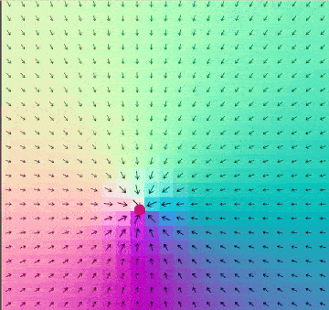

# Godot Flow Map Shader
Handy shader for visualizing vector fields and flow maps.

>[!info] ORIGINAL SHADER by Gehtsiegarnixan https://www.shadertoy.com/view/dssyzf 
> MODIFIED BY KeyboardMoss for godot

# Usage Details
Shader input is a regular texture which is updated at regular intervals as needed.
- Each pixel represents a single vector and is scaled to match the plane surface.
- Red and Green channels store normalized vector directions, centered at <0.5,0.5> and ranging from 0.0 to 1.0
- Blue channel stores amplitude.
- RGBA8 is sufficient but suffers from some precision (+/-5deg).

# Demo
Project contains a demo scene with a script that generates the texture from a vector field.

